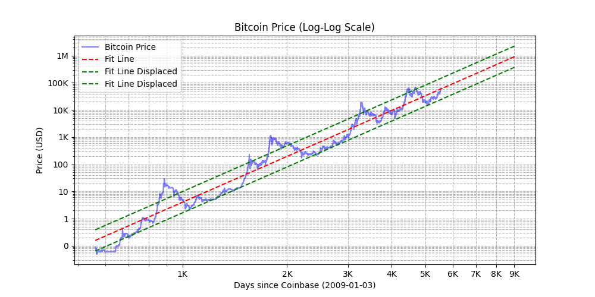

# Bitcoin Price Log-Log Visualization

This Python repository is dedicated to visualizing the price of Bitcoin using a log-log scale to highlight exponential trends and potential power-law correlations within the data. Inspired by the influential work of PlanB (@100trillionUSD) and the insightful analysis of BTC_POWER_LAW (@Giovann35084111), this project aims to provide a graphical representation of Bitcoin's price history in a way that emphasizes its growth patterns over time.

## Introduction

Bitcoin, the first decentralized digital currency, has shown a remarkable growth trajectory since its inception. Traditional linear price charts can often obscure the nature of this growth, making it difficult to appreciate the scale of change over time. By plotting price data on a log-log scale, we can better visualize multiplicative processes and gain insights into the underlying dynamics of Bitcoin's market value.

## Requirements

To use this repository, you will need:

- Python 3.x
- Pandas library
- Matplotlib library
- Requests library

These libraries are required for data manipulation, fetching data from APIs, and plotting.

## Installation

Clone the repository to your local machine:

```bash
git clone https://github.com/your-username/bitcoin-price-loglog.git
cd bitcoin-price-loglog
```

## Create a virtual environment
#### On windows
```bash
python -m venv venv
venv\Scripts\activate
```

#### On MacOS
```bash
python -m venv venv
source venv/bin/activate
```
With the virtual environment activated, install the required packages:

```
pip install -r requirements.txt
```
## Acknowledgments
This project was inspired by the work of:

- PlanB (@100trillionUSD) for his Stock-to-Flow model and its implications for understanding Bitcoin's value proposition.
- BTC_POWER_LAW (@Giovann35084111) for exploring the power-law presence in Bitcoin's price history and its potential as a predictive tool.

Their contributions to the Bitcoin community have provided valuable perspectives on the economic and mathematical aspects of cryptocurrency.

## Disclaimer
The visualizations provided by this repository are for educational purposes only and should not be construed as financial advice. The accuracy of the data cannot be guaranteed, and users should conduct their own due diligence before making any investment decisions.

## Visualization



6000 days = 2025-06-08

7000 days = 2028-03-04

8000 days = 2030-11-29

9000 days = 2033-08-25

Author: 

Twitter/X: @jesusbtd
